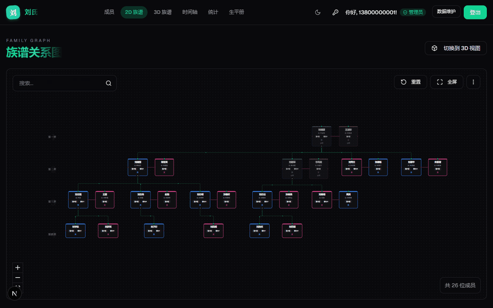

# pure-genealogy 族谱管理系统

<p align="center">
  
</p>

<p align="center">
  一个基于 Next.js 15 + React 19 + MySQL 8 构建的现代化、全中文、多家族族谱管理系统。
</p>

## ✨ 项目亮点

- **自建认证体系**: 手机号 + bcrypt 密码哈希 + 服务端会话 (httpOnly Cookie)，无第三方依赖。
- **多家族数据隔离**: 每个家族拥有独立数据空间，家族之间互不可见。注册新家族自动成为管理员，凭邀请码（8 位纯数字）加入既有家族为只读成员。
- **角色权限控制**: 管理员可增删改成员、批量导入、重置邀请码；只读成员无任何写权限（服务端强制校验）。
- **账号-成员关联**: 注册/代建账号自动以本人姓名入谱；管理员可代长辈建号、重置密码（重置后强制下线）、调整账号与成员的关联。
- **配偶正式入谱**: 配偶是可编辑的正式成员（双向 `spouse_id` 关联），增删改自动同步；族内女儿挂父系之下，外姓女婿以情侣单元并排展示。
- **多维可视化**:
  - **2D 族谱图**: Dagre 自动布局 + 情侣单元 + 婚姻连线，世代标尺、支系渐变色、金线溯源/金扇繁衍双向高亮、高清导出、折叠展开。
  - **3D 关系网**: 力导向三维图，含婚姻连边与自动巡游 (Auto Tour) 漫游。
  - **统计仪表盘**: KPI 动效卡片、家族剪影纪录（人丁最旺/最长者/享年之冠）、环形图、年龄分布、名字用字榜。
  - **历史时间轴**: 直观展示家族成员生卒年时间分布。
- **沉浸式体验**:
  - **生平册**: 全员入册的仿真翻页书，目录弹窗（可搜索）+ 可拖拽进度条导航，未写生平者显示已知信息摘要与待补录提示。
  - **"Living Book" 详情页**: 3D 翻书交互，正面档案、背面生平。
  - **富文本生平**: Slate.js 编辑器，阅读模式支持逐字书写/毛笔扫过艺术动效。

## 🛠️ 技术栈

- **框架**: [Next.js 15](https://nextjs.org/) (App Router, Server Actions) + [React 19](https://react.dev/)
- **数据库**: [MySQL 8](https://www.mysql.com/) ([mysql2](https://github.com/sidorares/node-mysql2) 连接池)
- **认证**: bcryptjs (密码哈希) + 服务端 Session + httpOnly Cookie
- **UI 组件库**: [shadcn/ui](https://ui.shadcn.com/) (基于 Radix UI)
- **样式**: [Tailwind CSS](https://tailwindcss.com/) + [next-themes](https://github.com/pacocoursey/next-themes) (明暗主题)
- **可视化**:
  - [@xyflow/react](https://reactflow.dev/) + [@dagrejs/dagre](https://github.com/dagrejs/dagre) (2D 族谱图自动布局)
  - [react-force-graph-3d](https://github.com/vasturiano/react-force-graph-3d) + [three.js](https://threejs.org/) (3D 关系网)
  - [recharts](https://recharts.org/) (统计图表)
- **富文本**: [Slate.js](https://docs.slatejs.org/) (生平事迹编辑)
- **工具**: TypeScript, ESLint, Lucide React (图标), html-to-image (图片导出), xlsx (Excel 批量导入导出)

## 🚀 主要功能

### 1. 成员管理 (`/family-tree`)
- **成员档案**: 姓名、世代、排行、父亲、配偶（下拉选择族内成员）、性别、生卒年、居住地、官职头衔、在世状态。
- **批量导入**: Excel/CSV 导入，支持父子任意顺序（依赖排序插入算法），同批内自动匹配父亲与配偶姓名。
- **权限区分**: 管理员可见增删改/导入按钮；只读成员界面自动隐藏，服务端二次拦截。

### 2. 家族管理（家族设置弹窗）
- **邀请码**: 查看纯数字邀请码、一键复制、随时重置。
- **代建账号**: 为不会注册的长辈代建账号，自动关联族谱成员。
- **账号管理**: 列出本家族全部账号，支持重置密码、更改账号与成员的关联。

### 3. 可视化视图
- **2D 族谱图 (`/family-tree/graph`)**: 情侣单元并排布局、粉色婚姻连线、水墨世代标尺、支系渐变色、搜索高亮（配偶联动）、节点折叠、高清图片导出。
- **3D 力导向图 (`/family-tree/graph-3d`)**: 星空漫游、婚姻连边、自动巡游（自动规划两名成员间关系路径并飞行浏览）。
- **统计仪表盘 (`/family-tree/statistics`)**: 族人总数/繁衍世代/在世族人/结缡夫妻 KPI 卡、家族剪影、性别与在世环形图、世代分布、年龄分布、名字用字榜。
- **时间轴 (`/family-tree/timeline`)**: 横向时间轴展示家族历史跨度。
- **生平册 (`/family-tree/biography-book`)**: 全员入册，目录 + 进度条 + 键盘翻页（← →）。

### 4. 认证与安全
- 注册（创建家族 / 凭邀请码加入）、登录（记住我 7/30 天）、登出。
- 密码 bcrypt 哈希存储；会话 httpOnly Cookie；过期会话自动清理。
- 代理层 (`proxy.ts`) 拦截未登录访问，保护页面自动跳转登录。

## 📦 快速开始

### 环境要求

- Node.js 18.18+（推荐 20+）
- MySQL 8.x

### 1. 克隆项目

```bash
# GitHub
git clone https://github.com/xuwanzhu/pure-genealogy.git
# 或 Gitee
git clone https://gitee.com/xuwanzhu/pure-genealogy.git

cd pure-genealogy
```

### 2. 安装依赖

```bash
npm install
```

### 3. 初始化数据库

使用仓库自带的建表脚本（创建 `genealogy` 库及 families / users / sessions / family_members 四张表）：

```bash
mysql -u root -p < scripts/init-mysql.sql
```

### 4. 配置环境变量

复制 `.env.example` 为 `.env.local`，填入数据库连接信息：

```env
MYSQL_HOST=127.0.0.1
MYSQL_PORT=3306
MYSQL_USER=root
MYSQL_PASSWORD=你的数据库密码
MYSQL_DATABASE=genealogy
```

### 5. 启动

```bash
npm run dev
```

访问 [http://localhost:3000](http://localhost:3000)，注册即可创建第一个家族（自动成为管理员）。

### 6. （可选）演示数据

```bash
node scripts/seed-demo.mjs          # 插入演示数据 (已存在则跳过)
node scripts/seed-demo.mjs --force  # 清空演示家族后重新插入 (不影响其他家族数据)
```

生成四代演示家族「刘氏」（24 位成员，含配偶双向关联），并附两个演示账号：

| 手机号 | 密码 | 角色 | 关联成员 |
|---|---|---|---|
| 13800000001 | Test123456 | 管理员（可写） | 刘志强 |
| 13800000002 | Test123456 | 只读成员 | 刘晓梅 |

## 🗄️ 数据库结构

| 表 | 说明 |
|---|---|
| `families` | 家族（姓氏、名称、唯一邀请码） |
| `users` | 账号（手机号、bcrypt 哈希、角色 admin/viewer、所属家族） |
| `sessions` | 服务端会话（httpOnly Cookie 对应，过期自动清理） |
| `family_members` | 族谱成员（世代、排行、父亲、配偶双向关联、账号关联、生平富文本） |

关键约束：
- `family_members.user_id` 唯一索引 —— 每个账号最多关联一个成员
- `family_members.spouse_id` 双向关联 —— 配偶互指，删除自动解绑
- `families.invite_code` 唯一 —— 加入家族的凭证

## 📂 项目结构

```
/
├── app/                      # Next.js App Router
│   ├── auth/                 # 登录/注册 (手机号 + 创建/加入家族)
│   │   └── actions.ts        # 认证 Server Actions (含账号管理/重置密码)
│   ├── family-tree/          # 族谱功能区
│   │   ├── graph/            # 2D 族谱图 (React Flow + Dagre)
│   │   ├── graph-3d/         # 3D 关系网 (Force Graph)
│   │   ├── statistics/       # 统计仪表盘
│   │   ├── timeline/         # 时间轴
│   │   ├── biography-book/   # 生平册
│   │   ├── actions.ts        # 成员 CRUD Server Actions (配偶双向关联/批量导入)
│   │   └── layout.tsx        # 导航布局 (品牌随家族动态显示)
├── proxy.ts                  # 路由保护 (登录态检查)
├── components/               # React 组件
│   ├── ui/                   # shadcn/ui 基础组件
│   ├── rich-text/            # Slate 富文本编辑器
│   └── sign-up-form.tsx      # 注册 (创建/加入家族双流程)
├── lib/
│   ├── db.ts                 # MySQL 连接池
│   └── auth.ts               # bcrypt + 会话 + 权限工具
└── scripts/                  # 数据库脚本 (建表/演示数据/历史迁移)
```

## 📄 许可证

本项目采用 [MIT](LICENSE) 许可证。
